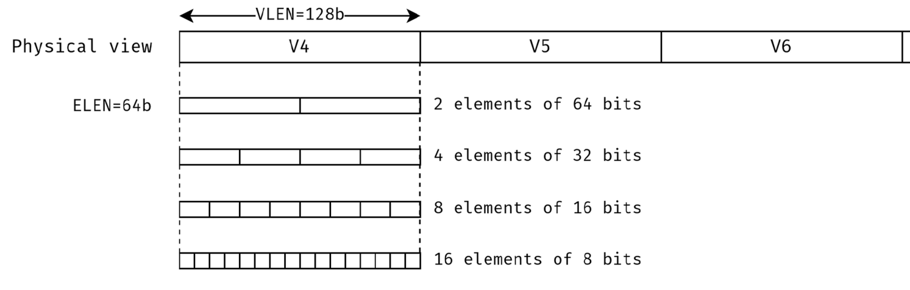
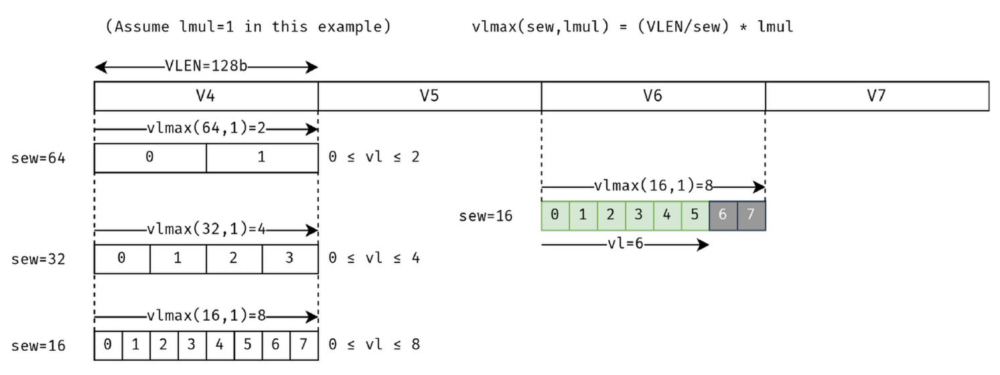
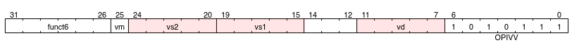

Notes for the development of the project

VLEN = 128 -> vector registers of 128 bits
ELEN = 32 -> vector elements of a maximun 32 bits.

Start by doing the vector equivalent of most scalar arithmetic counter part, in vector-vector format (.vv)

sew: standard element width, size in bits of elements (programmer might be able to choose this)
lmul: Soemthing about grouping registers, how many registers are grouped together to form a vector register
    it can only be {1/8, 1/4, 1/2, 1, 2, 4, 8}

vl: vector length, number of elements in a vector register that we are going to operate on,
    0 <= vl <= (VLEN/sew) x lmul

idea: finish creating the assembler.

Actual state:
- Integrate the fetch unit with only the signals we need for now, this fetch unit will be used later because it is
    from the host RISCV that we will use to run our vector unit.

Caution: Don't set input parameters on clock posedge, it ruins timing and registers load