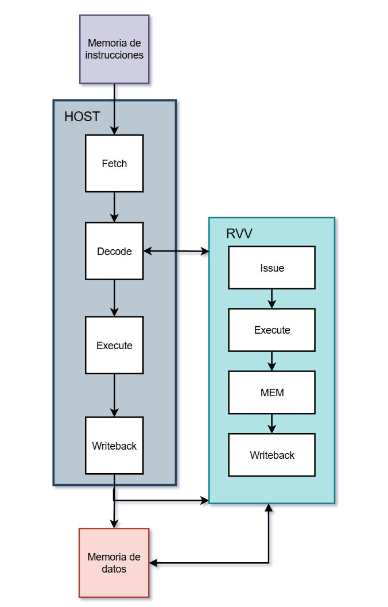
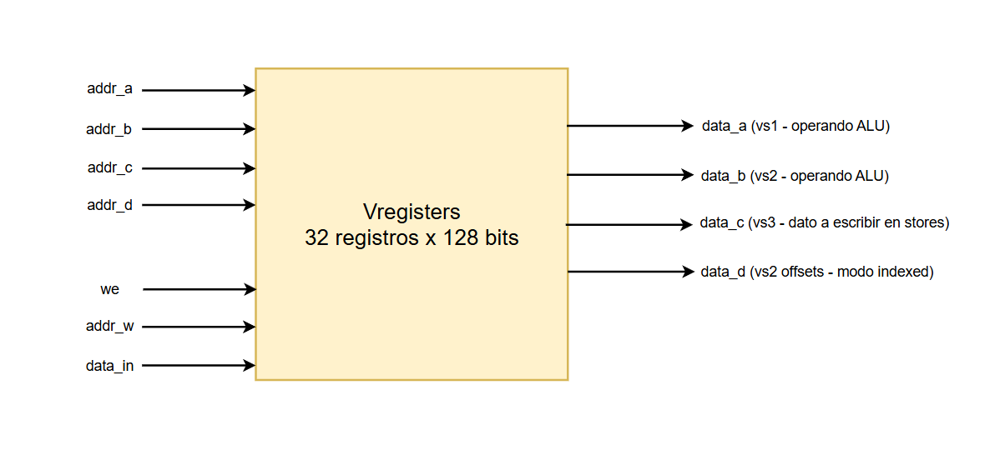

# Extensión Vectorial — Documentación del Proyecto

---

## 1. Descripción General

Este proyecto implementa un subconjunto mínimo de la especificación de extensión vectorial de RISC-V (RVV 1.0) como un co-procesador acoplado a un procesador escalar RISC-V host. El objetivo es una implementación en hardware funcionalmente correcta que cubra las operaciones vectoriales aritméticas y de acceso a memoria.

En [este archivo](spec_overview.md) se puede ver un resumen de las partes importantes de la especificación RVV para este proyecto.

### 1.1 Parámetros Fijos

Para nuestra implementación los siguientes parámetros seran fijos y no se podran modificar en tiempo de ejecución.

| Parámetro | Valor | Descripción |
|-----------|-------|-------------|
| VLEN | 128 bits | Ancho de cada registro vectorial |
| SEW | 32 bits | Ancho de elemento estándar — solo se soportan elementos de 32 bits |
| LMUL | 1 | Agrupamiento de registros — cada instrucción opera sobre exactamente un registro |
| VLMAX | 4 | Número máximo de elementos por instrucción (VLEN / SEW) |
| Registros vectoriales | 32 | v0 – v31, cada uno de 128 bits |

Dado que SEW y LMUL son fijos, no existe configuración de vtype en tiempo de ejecución. Todas las instrucciones operan implícitamente sobre 4 elementos de 32 bits cada uno.

La razón principal de esta elección de parámetros fijos es que el procesador es de 32 bits.


La imagen anterior muestra cómo un registro vectorial de 128 bits aloja 4 elementos independientes de 32 bits.

### 1.2 Funcionalidades e instrucciones implementadas

- Aritmética vectorial-vectorial (ADD, SUB, AND, OR, XOR, SLL, SRL, SRA, SLT, SLTU)
- Aritmética vectorial-escalar (modo VX): el valor escalar se replica en los 4 carriles
- Acceso vectorial a memoria: cargas y almacenamientos en modalidad unit-stride, strided e indexed
- Carga y almacenamiento del registro de máscara (VLM/VSM) sobre v0

### 1.3 Limitaciones Conocidas

Las siguientes características de la especificación RVV 1.0 **no están implementadas**:

- **Registros CSR:** vtype, vl, vstart, vxrm, vxsat y vcsr no existen en el diseño. No hay configuración de tipo ni de longitud de vector en tiempo de ejecución.
- **vl variable:** La implementación siempre procesa los 4 elementos (VLMAX). No existe ejecución de vector parcial.
- **Enmascaramiento por elemento:** La semántica de elementos activos/inactivos (vma) no se aplica. El flag de operación de máscara solo habilita o deshabilita el acceso a DCache para las instrucciones VLM/VSM; no controla la ejecución condicional en operaciones aritméticas.
- **Instrucciones de segmento:** Las variantes vlseg/vsseg no están implementadas.
- **Cargas fault-only-first:** vle\<eew>ff.v no está implementado.
- **Carga/almacenamiento de registro completo:** vl1r/vs1r y sus variantes no están implementados.
- **SEW < 32 o SEW = 64:** Solo se soportan elementos de 32 bits.
- **LMUL ≠ 1:** El agrupamiento de registros está fijo en LMUL=1.

---

## 2. Arquitectura de Alto Nivel

### 2.1 Contexto del Sistema

Esta extensión vectorial funciona como co-procesador junto al procesador escalar RISC-V host. El procesador host es responsable del fetch de instrucciones, la decodificación y la lectura de registros escalares. Cuando el decodificador identifica una instrucción vectorial, envía señales de control pre-decodificadas y valores de operandos escalares directamente a la extensión vectorial a través de la interfaz de `ve_top` — la extensión vectorial no posee decodificador de instrucciones propio.




El decodificador del host provee dos caminos de entrada independientes a la extensión vectorial:

- **Camino ALU:** campos de instrucción (funct7, funct3, rs1, rs2, rd), una bandera que indica modo vectorial-escalar (`i_is_vx`) y el valor del operando escalar.
- **Camino LSU:** banderas de operación de memoria decodificadas (carga, almacenamiento, strided, indexed, operación de máscara), la dirección base (valor de rs1 del banco de registros escalar) y el stride (valor de rs2).

La extensión vectorial aserta `o_stall` de regreso al decodificador del host cuando instrucciones LSU consecutivas generarían un conflicto en el bus de la caché de datos.

### 2.2 Descripción del Pipeline

La extensión vectorial utiliza un pipeline de 4 etapas. Una instrucción recorre las cuatro etapas antes de que su resultado sea confirmado en el banco de registros vectoriales.

| Etapa | Módulo | Responsabilidad |
|-------|--------|-----------------|
| Issue | `issue` | Lee operandos del VRF, captura campos de la instrucción en registros de pipeline |
| Execute | `execute` | Calcula el resultado ALU; emite el primer acceso a DCache (elementos 0–1) para LSU |
| MEM | `mem` | Emite el segundo acceso a DCache (elementos 2–3) para LSU; ensambla el resultado de 128 bits en cargas |
| Writeback | `writeback` | Escribe el resultado de vuelta al VRF (omitido en almacenamientos) |

### 2.3 Lista de Módulos

| Módulo | Archivo | Función |
|--------|---------|---------|
| `ve_top` | [rtl/ve_top.v](../rtl/ve_top.v) | Módulo raíz: instancia todos los submódulos, lógica de stall y mux de DCache |
| `vregisters` | [rtl/vregfile/vregisters.v](../rtl/vregfile/vregisters.v) | Banco de registros vectoriales de 32 × 128 bits |
| `alu` | [rtl/alu/alu.v](../rtl/alu/alu.v) | Carril aritmético/lógico individual de 32 bits |
| `alu_array` | [rtl/alu/alu_array.v](../rtl/alu/alu_array.v) | 4 carriles ALU en paralelo operando sobre un vector de 128 bits |
| `vlsu` | [rtl/LSU/vlsu.v](../rtl/LSU/vlsu.v) | Generador combinacional de direcciones y señales de control para acceso a memoria |
| `issue` | [rtl/pipeline/issue.v](../rtl/pipeline/issue.v) | Etapa 1 del pipeline |
| `execute` | [rtl/pipeline/execute.v](../rtl/pipeline/execute.v) | Etapa 2 del pipeline |
| `mem` | [rtl/pipeline/mem.v](../rtl/pipeline/mem.v) | Etapa 3 del pipeline |
| `writeback` | [rtl/pipeline/writeback.v](../rtl/pipeline/writeback.v) | Etapa 4 del pipeline |
| `dcache` | [rtl/memory/DCache.sv](../rtl/memory/DCache.sv) | Caché de datos de doble puerto (128 palabras de 32 bits) |

### 2.4 Mecanismo de Stall

Dado que una instrucción LSU vectorial ocupa el bus de DCache durante dos etapas consecutivas del pipeline (Execute y MEM), dos instrucciones LSU consecutivas generarían un conflicto. La condición de stall es:

```
stall = s1_is_lsu AND s2_is_lsu
```

Cuando se aserta:
- La etapa **Issue** mantiene sus registros sin cambios.
- La etapa **Execute** inserta una burbuja en MEM (fuerza `o_valid = 0`, `o_is_lsu = 0`).
- La etapa **MEM** continúa normalmente con la instrucción que ya está en vuelo.
- `o_stall` se aserta alto hacia el decodificador del host para que no emita una nueva instrucción en ese ciclo.

### 2.5 Arbitraje del Bus de DCache

La DCache tiene dos puertos (A y B). Tanto Execute como MEM generan señales hacia la DCache, pero el mecanismo de stall garantiza que nunca estén ambas activas para LSU al mismo tiempo. Un mux combinacional en `ve_top` selecciona cuál etapa maneja el bus:

```
sel_mem = s2_is_lsu AND NOT s2_is_mask_op
```

Cuando `sel_mem = 1`, las señales ACCESS_23 de MEM se enrutan hacia la DCache. Cuando `sel_mem = 0`, se usan las señales ACCESS_01 de Execute. Las operaciones de máscara quedan fuera de esta selección (ACCESS_23 se deshabilita para VLM/VSM ya que solo se accede al elemento 0).

---

## 3. Banco de Registros Vectoriales (VRF)

El banco de registros vectoriales almacena el estado de los 32 registros vectoriales `v0`–`v31`. Es el punto de partida y destino de toda operación vectorial: las instrucciones leen sus operandos de aquí al inicio del pipeline y escriben su resultado de vuelta al final.



Para el empaquetado de los elementos dentro de cada registro de 128 bits, ver [spec_overview.md — Sección 3](spec_overview.md#3-empaquetado-de-elementos-en-registros).

### 3.1 Estructura

El VRF implementa un arreglo de 32 registros de 128 bits cada uno. Todas las lecturas son **combinacionales** — los datos están disponibles el mismo ciclo en que se presenta la dirección. Las escrituras son **síncronas**.

En reset, todos los registros se inicializan a cero.

### 3.2 Puertos de Lectura

El VRF expone cuatro puertos de lectura independientes para permitir que una sola instrucción acceda a todos los operandos que necesita simultáneamente, sin necesidad de ciclos adicionales.

| Puerto | Dirección | Dato | Uso |
|--------|-----------|------|-----|
| A | `addr_a` | `data_a` | Primer operando de la ALU (`vs1`) |
| B | `addr_b` | `data_b` | Segundo operando de la ALU (`vs2`) |
| C | `addr_c` | `data_c` | Dato a escribir en memoria en almacenamientos (`vs3`) |
| D | `addr_d` | `data_d` | Offsets de dirección en modo indexed (`vs2` offsets) |

Los puertos C y D son necesarios por el modo indexed de la VLSU: en ese modo `vs2` cumple el rol de registro de offsets (puerto D), y el dato que se almacena en memoria viene del campo `rd` de la instrucción reinterpretado como `vs3` (puerto C). La especificación los trata como operandos distintos, por eso requieren puertos separados. Para más detalle ver [spec_overview.md — Sección 4.3](spec_overview.md#43-eew-en-modo-indexed).

### 3.3 Puerto de Escritura

El VRF tiene un único puerto de escritura síncrono:

| Señal | Descripción |
|-------|-------------|
| `we` | Habilitación de escritura |
| `addr_w` | Registro destino (0–31) |
| `data_in` | Dato a escribir (128 bits) |

La etapa Writeback es la única que conduce este puerto. Solo escribe cuando la instrucción es válida y no es un almacenamiento — los stores escriben en memoria, no en el VRF.

### 3.4 Registro de Máscara v0

El registro `v0` no tiene tratamiento especial en el hardware del VRF: puede leerse y escribirse a través de los mismos puertos que cualquier otro registro. Su rol especial como registro de máscara es una convención de la especificación que se para usar las instrucciones VLM y VSM, las cuales apuntan siempre a `v0` como destino o fuente.


## 4. ALU Vectorial

La ALU vectorial ejecuta operaciones aritméticas y lógicas elemento a elemento sobre vectores de 128 bits. Está compuesta por cuatro carriles de 32 bits que operan en paralelo, produciendo los cuatro resultados en un único ciclo combinacional.

### 4.1 Estructura de Carriles

El módulo `alu_array` instancia cuatro unidades `alu` idénticas de 32 bits. Cada carril recibe el slice de 32 bits correspondiente de los operandos de entrada y produce su resultado de 32 bits de forma independiente. La misma operación (`alu_op`) se aplica a los cuatro carriles simultáneamente.

```
alu_array (128 bits)
├── carril 0: in_a[31:0]   op in_b[31:0]   → out[31:0]
├── carril 1: in_a[63:32]  op in_b[63:32]  → out[63:32]
├── carril 2: in_a[95:64]  op in_b[95:64]  → out[95:64]
└── carril 3: in_a[127:96] op in_b[127:96] → out[127:96]
```

### 4.2 Operaciones Soportadas

La operación a ejecutar se codifica en 4 bits formados por `{funct7[5], funct3}`, tomados directamente de la instrucción RISC-V. Este encoding es el mismo que usa la ALU escalar del procesador host para instrucciones de tipo R.

| `alu_op` | `funct7[5]` | `funct3` | Operación | Descripción |
|----------|-------------|----------|-----------|-------------|
| `4'b0000` | 0 | 000 | ADD  | Suma |
| `4'b1000` | 1 | 000 | SUB  | Resta |
| `4'b0001` | 0 | 001 | SLL  | Desplazamiento lógico a la izquierda |
| `4'b0010` | 0 | 010 | SLT  | Comparación con signo (resultado 0 o 1) |
| `4'b0011` | 0 | 011 | SLTU | Comparación sin signo (resultado 0 o 1) |
| `4'b0100` | 0 | 100 | XOR  | XOR bit a bit |
| `4'b0101` | 0 | 101 | SRL  | Desplazamiento lógico a la derecha |
| `4'b1101` | 1 | 101 | SRA  | Desplazamiento aritmético a la derecha |
| `4'b0110` | 0 | 110 | OR   | OR bit a bit |
| `4'b0111` | 0 | 111 | AND  | AND bit a bit |

Para los desplazamientos (SLL, SRL, SRA) solo se usan los 5 bits menos significativos del operando `in_b`, siguiendo la misma convención que la instrucción escalar equivalente.

### 4.3 Modo VX — Operaciones Vectorial-Escalar

En modo VX (`i_is_vx = 1`), el segundo operando de la ALU no proviene de un registro vectorial sino de un registro escalar del procesador host. Para que la `alu_array` pueda operar sin modificaciones, la etapa Issue replica el valor escalar en los cuatro slots de 32 bits del operando `vs2` antes de capturarlo en el registro de pipeline:

```
vs2_replicado = { escalar, escalar, escalar, escalar }  // 4 × 32 bits
```

Desde la perspectiva de Execute y de la `alu_array`, una instrucción VX es indistinguible de una VV — ambas llegan con dos operandos vectoriales de 128 bits.

