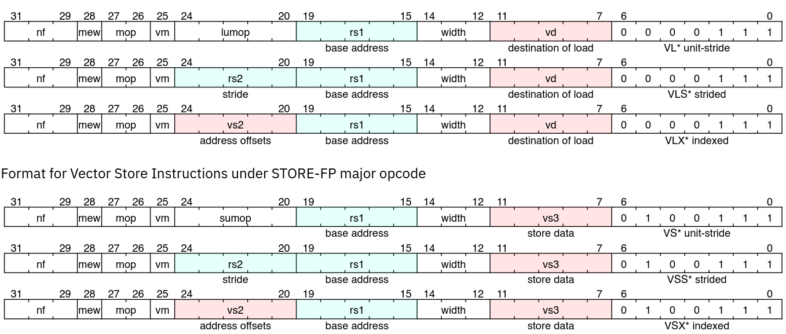
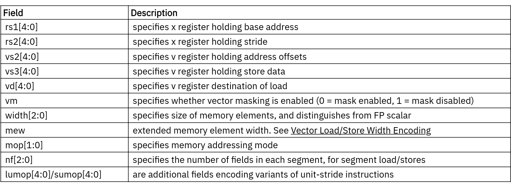
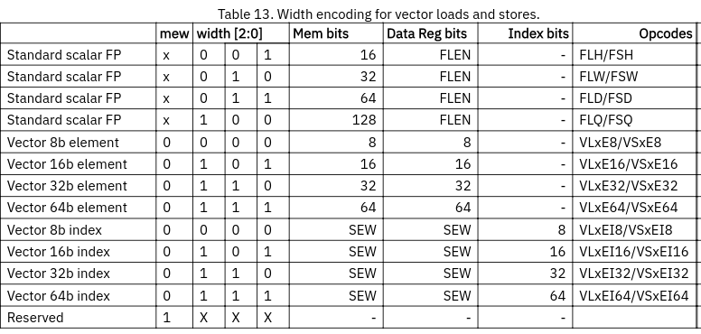
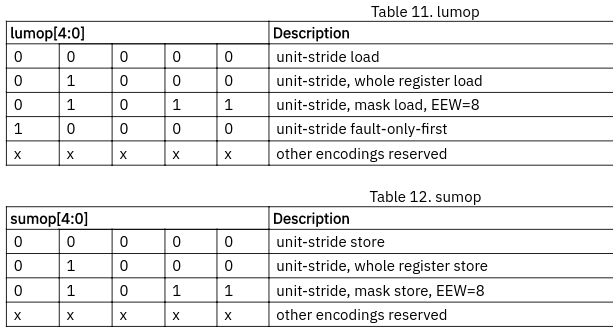

# Conceptos Base de la Especificación RVV 1.0

Este documento extrae los conceptos mínimos de la especificación RISC-V Vector Extension 1.0 que son necesarios para entender la implementación de este proyecto. No es un resumen completo de la especificación — solo cubre lo que está directamente implementado o lo que es necesario para entender las decisiones de diseño.

---

## 1. Registros Vectoriales

La extensión vectorial agrega al procesador un banco de **32 registros vectoriales** denominados `v0` a `v31`. Cada registro tiene un ancho fijo definido por el parámetro **VLEN**. En esta implementación VLEN = 128 bits.

El registro `v0` cumple un rol especial: es el **registro de máscara**. Puede leerse y escribirse como cualquier otro registro vectorial, pero también es la fuente de bits de máscara que controlan qué elementos son activos en una operación. En nuestra implementación el registro de máscara se usa exclusivamente para las instrucciones VLM y VSM.

---

## 2. Parámetros de Configuración

La especificación define estos parámetros como configurables en tiempo de ejecución a través de instrucciones especiales. En esta implementación todos son **fijos en tiempo de diseño**.

### SEW — Standard Element Width

Define el tamaño en bits de cada elemento dentro de un registro vectorial. La especificación permite valores de 8, 16, 32 y 64 bits.

**En esta implementación: SEW = 32 bits fijo.** La razón principal es que el procesador anfitrión es de 32 bits, por lo que los datos escalares y las direcciones de memoria son naturalmente de 32 bits.

### LMUL — Length Multiplier

Define cuántos registros vectoriales se agrupan para formar un "registro lógico" en una instrucción. Puede ser una fracción (1/8, 1/4, 1/2) o un entero (1, 2, 4, 8).

- Con LMUL = 1 cada instrucción opera sobre un único registro vectorial.
- Con LMUL = 2 las instrucciones operan sobre pares de registros, duplicando la cantidad de elementos procesados.

**En esta implementación: LMUL = 1 fijo.**

### VLMAX — Máximo número de elementos

Se deriva directamente de los parámetros anteriores:

```
VLMAX = (VLEN / SEW) * LMUL = (128 / 32) * 1 = 4
```

**En esta implementación toda instrucción vectorial opera siempre sobre exactamente 4 elementos.**

La especificación define además un registro `vl` (vector length) que permite operar sobre un subconjunto de elementos (0 ≤ vl ≤ VLMAX). Este registro **no está implementado** — nuestra implementación siempre procesa los 4 elementos completos.

---

## 3. Empaquetado de Elementos en Registros

Los elementos se almacenan dentro de un registro vectorial comenzando por el byte menos significativo. Para LMUL = 1 y SEW = 32, los 4 elementos de 32 bits se distribuyen así dentro de los 128 bits del registro:

```
Bits [127:96]  →  Elemento 3
Bits  [95:64]  →  Elemento 2
Bits  [63:32]  →  Elemento 1
Bits  [31: 0]  →  Elemento 0
```

Este empaquetado es fundamental para entender cómo el VLSU divide un vector en accesos individuales a memoria y cómo el resultado de una carga se ensambla de vuelta en 128 bits.

### Layout del Registro de Máscara

El registro de máscara `v0` sigue una convención diferente: el bit `i` de `v0` es el bit de máscara del elemento `i`, independientemente de SEW o LMUL. Para nuestra implementación con 4 elementos:

```
v0[0]  →  máscara del elemento 0
v0[1]  →  máscara del elemento 1
v0[2]  →  máscara del elemento 2
v0[3]  →  máscara del elemento 3
```

Las instrucciones VLM y VSM cargan y almacenan exactamente `ceil(vl / 8)` bytes de `v0`. Con vl = 4: `ceil(4/8) = 1` byte — solo el byte 0 del registro vectorial es accedido.

---

## 4. Instrucciones de Carga y Almacenamiento Vectorial

### 4.1 Modos de Direccionamiento

La especificación define tres modos de calcular las direcciones de memoria para acceso vectorial. El modo se codifica en el campo `mop[1:0]` de la instrucción:

| mop[1:0] | Modo | Descripción |
|----------|------|-------------|
| 0 0 | Unit-stride | Elementos contiguos en memoria a partir de la dirección base |
| 0 1 | Indexed-unordered | Dirección de cada elemento = base + offset[i] de un registro vectorial |
| 1 0 | Strided | Elementos separados por un salto fijo (stride) entre sí |
| 1 1 | Indexed-ordered | Igual que indexed-unordered pero con orden garantizado |

La dirección base siempre proviene del registro escalar `rs1`. Estos tres modos se encuentran implementados en este proyecto.

**Unit-stride:** los 4 elementos se encuentran en posiciones consecutivas de memoria.
```
elem[0] → mem[base]
elem[1] → mem[base + 4]
elem[2] → mem[base + 8]
elem[3] → mem[base + 12]
```

**Strided:** los elementos están separados por un salto constante `stride`, que proviene del registro escalar `rs2`. El stride puede ser negativo o cero.
```
elem[0] → mem[base]
elem[1] → mem[base + stride]
elem[2] → mem[base + stride*2]
elem[3] → mem[base + stride*3]
```

**Indexed:** cada elemento tiene su propia dirección calculada sumando la base con un offset individual leído de un registro vectorial `vs2`.
```
elem[0] → mem[base + vs2[0]]
elem[1] → mem[base + vs2[1]]
elem[2] → mem[base + vs2[2]]
elem[3] → mem[base + vs2[3]]
```

### 4.2 Encoding de las Instrucciones

Las instrucciones de carga vectorial se codifican de la siguiente forma:



Las instrucciones de almacenamiento vectorial:



El campo `width` (bits [14:12]) codifica el EEW — el ancho efectivo del elemento. En esta implementación siempre se usa EEW = 32 (`width = 3'b010`).

### 4.3 EEW en Modo Indexed

En modo indexed la especificación hace una distinción importante: el campo `width` de la instrucción describe el ancho de los **offsets** en `vs2` (EEW), no el ancho de los datos que se cargan o almacenan. Los datos usan siempre SEW.



Esta distinción tiene una consecuencia directa en el hardware: el registro `vs2` (offsets) y el registro de datos (`vd` o `vs3`) deben leerse en paralelo como operandos independientes. Esto explica la existencia del **cuarto puerto de lectura** del banco de registros vectoriales.

### 4.4 Submodos de Unit-Stride

Dentro del modo unit-stride, el campo `lumop` (cargas) o `sumop` (almacenamientos) codifica variantes especiales:



De estos submodos, esta implementación soporta:
- **`lumop/sumop = 00000`**: operación unit-stride estándar.
- **`lumop = 01011` / `sumop = 01011`**: VLM y VSM — carga y almacenamiento del registro de máscara `v0`.

### 4.5 Instrucciones Implementadas

A continuación la lista completa de instrucciones de memoria vectorial soportadas en este proyecto:

**Unit-stride (SEW = 32 fijo):**
```
vle32.v   vd, (rs1)        # carga unit-stride
vse32.v   vs3, (rs1)       # almacenamiento unit-stride
vlm.v     vd, (rs1)        # carga del registro de máscara v0
vsm.v     vs3, (rs1)       # almacenamiento del registro de máscara v0
```

**Strided (SEW = 32 fijo):**
```
vlse32.v  vd, (rs1), rs2   # carga strided
vsse32.v  vs3, (rs1), rs2  # almacenamiento strided
```

**Indexed (EEW = 32 para offsets, SEW = 32 para datos):**
```
vluxei32.v  vd, (rs1), vs2   # carga indexed unordered
vloxei32.v  vd, (rs1), vs2   # carga indexed ordered
vsuxei32.v  vs3, (rs1), vs2  # almacenamiento indexed unordered
vsoxei32.v  vs3, (rs1), vs2  # almacenamiento indexed ordered
```

> **Nota:** Los modos indexed-ordered e indexed-unordered son funcionalmente equivalentes en esta implementación ya que el hardware no garantiza ni niega ningún orden específico de acceso entre elementos.
